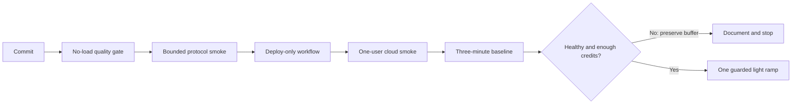

# Evidence Index

This index connects each performance-engineering claim to reproducible evidence. It is the
recommended starting point for a technical review or demonstration.

## Capability map

| Claim                                               | Implementation evidence                                                  | Execution evidence                                                                          | Current conclusion                                                                                 |
| --------------------------------------------------- | ------------------------------------------------------------------------ | ------------------------------------------------------------------------------------------- | -------------------------------------------------------------------------------------------------- |
| The target and workload are bounded                 | [`src/quickPizza.gatling.ts`](../src/quickPizza.gatling.ts)              | [Protocol smoke 35009097511](https://github.com/Monkno/Quickpizza/actions/runs/35009097511) | Only the approved HTTPS host and three finite profiles are accepted                                |
| Pull requests cannot create target traffic          | [Quality workflow](../.github/workflows/quality.yml)                     | [Quality 35038752866](https://github.com/Monkno/Quickpizza/actions/runs/35038752866)        | Formatting, safety policy, type checking, and packaging pass without load                          |
| Safety limits are enforced against repository drift | [Safety-policy verifier](../scripts/verify-safety.mjs)                   | [Quality 35038752866](https://github.com/Monkno/Quickpizza/actions/runs/35038752866)        | CI checks the fixed host, profiles, request count, generator, assertions, and manual-only triggers |
| A local-style run produces a native Gatling report  | [Protocol smoke workflow](../.github/workflows/protocol-smoke.yml)       | [Protocol smoke result](results/2026-09-15-protocol-smoke.md)                               | Two anonymous requests passed and the HTML report was retained                                     |
| Deployment is separated from execution              | [Deploy workflow](../.github/workflows/gatling-deploy.yml)               | [Deployment result](results/2026-09-15-gatling-deployment.md)                               | The package and three test definitions were deployed without starting load                         |
| Cloud connectivity works                            | [Cloud smoke workflow](../.github/workflows/gatling-cloud-smoke.yml)     | [Cloud smoke result](results/2026-09-15-cloud-smoke.md)                                     | One bounded journey passed with zero errors                                                        |
| The low-load baseline is healthy                    | [Baseline workflow](../.github/workflows/gatling-cloud-baseline.yml)     | [Cloud baseline result](results/2026-09-15-cloud-baseline.md)                               | 360 requests passed, with 0% errors, 44 ms p95, and 45 ms p99                                      |
| A ramp cannot run accidentally                      | [Light-ramp workflow](../.github/workflows/gatling-cloud-light-ramp.yml) | [Light-ramp result](results/2026-09-16-cloud-light-ramp.md)                                 | One bounded run passed; confirmation, environment gate, and shared concurrency remain enforced     |
| Results have explicit interpretation rules          | [Baseline governance](BASELINE_GOVERNANCE.md)                            | [Run-result template](results/RUN_RESULT_TEMPLATE.md)                                       | Pass, fail, inconclusive, compatibility, and change rules are versioned                            |

## Evidence flow

The original three-minute ramp followed the `Document and stop` path because its expected cost
would have reduced the protected investigation balance below three credits. The final profile was
then reduced to one minute while retaining the approved peak rate and followed the authorized
execution path.

## Verified observations

| Observation                       | Value                                                   |
| --------------------------------- | ------------------------------------------------------- |
| Anonymous protocol smoke          | 2 requests, 0 failures, 267 ms p95                      |
| Gatling Cloud connectivity smoke  | 2 requests, 0% errors, 179 ms p95                       |
| Controlled baseline               | 360 requests, 0% errors, 44 ms p95, 45 ms p99           |
| Controlled light ramp             | 150 requests, 0% errors, 45 ms p95, 47 ms p99           |
| Baseline workload                 | 1 journey/s for 3 minutes; 1.99 achieved requests/s     |
| Light-ramp workload               | 0.5–2 journeys/s for 1 minute; 2.42 achieved requests/s |
| Baseline cloud cost               | 4 credits                                               |
| Light-ramp cloud cost             | 2 credits                                               |
| Campaign balance after completion | 3 of 10 team credits remaining                          |
| Light-ramp status                 | Passed; no retry or confirmation run required           |

## What this evidence does not prove

- It is not a browser-rendering, Core Web Vitals, stress, capacity, or soak result.
- It does not establish a service-level objective from a single baseline.
- It does not identify a server-side cause because logs, traces, and infrastructure metrics are
  unavailable.
- It does not include the authenticated pizza endpoint. A human browser credential was not copied
  into automation.

See the [demonstration guide](DEMO_GUIDE.md) for a short walkthrough that uses this evidence without
running another test.
